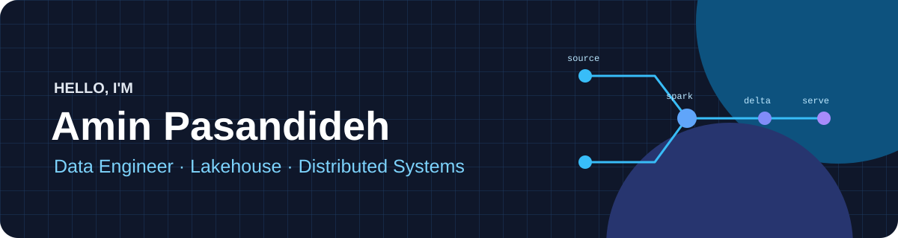
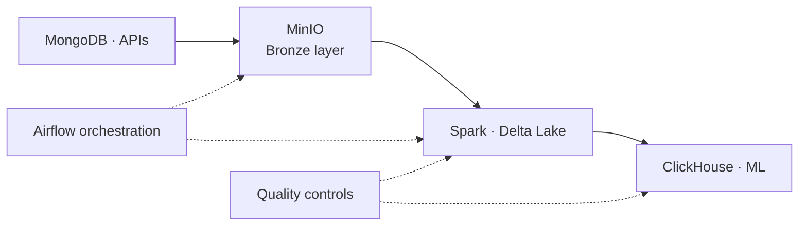

  

   

  
  
  

## About me

I am a **Data Engineer** with 1.5+ years of hands-on experience designing, building, and operating production data platforms. My work spans lakehouse architecture, distributed processing, workflow orchestration, data quality, and the infrastructure that keeps it all reliable.

I enjoy turning complex, high-volume data into dependable datasets for machine learning and analytics. My computer science and machine learning background helps me bridge the gap between platform engineering and downstream data consumers.

## Impact at a glance

| | |
|---|---|
| **1B+ records processed** | Built distributed PySpark workflows for recommendation-system training data |
| **Lakehouse, end to end** | Took an on-premises MinIO-based Medallion architecture from proof of concept to production |
| **Production orchestration** | Operated incremental ETL/ELT pipelines with Airflow scheduling, retries, monitoring, and failure handling |
| **Reliable by design** | Established schema, integrity, drift, outlier, lifecycle, backup, and disaster-recovery controls |

## Technical toolkit

**Data engineering**

**Databases & storage**

**Platform & operations**

## What I work on

- **Lakehouse architecture:** Bronze/Silver/Gold layers, ACID transactions, schema enforcement, versioning, time travel, and curated downstream datasets.
- **Large-scale processing:** distributed joins, aggregations, temporal feature extraction, and business-rule transformations with Spark/PySpark.
- **Data reliability:** validation for missing values, duplicates, outliers, schema drift, and referential integrity, plus Delta Lake `OPTIMIZE` and `VACUUM` lifecycle management.
- **Platform operations:** Dockerized deployments, Linux administration, Nginx, monitoring automation, S3-compatible storage, and `rclone`-based recovery workflows.

## Education

- **M.Sc. in Computer Science — Data Mining**, Shahid Beheshti University · 2025–Present
- **B.Sc. in Computer Science**, Ferdowsi University of Mashhad · 2019–2025

## Beyond the pipeline

My earlier work in machine learning includes feature engineering, supervised and unsupervised modeling, and end-to-end project delivery with scikit-learn, PyTorch, and TensorFlow. That experience shapes how I design datasets and platforms for real ML workloads—not just storage.

  Interested in data platforms, distributed systems, and ML infrastructure? <a href="mailto:aminpasandideh2000@gmail.com">Let's connect.</a>

